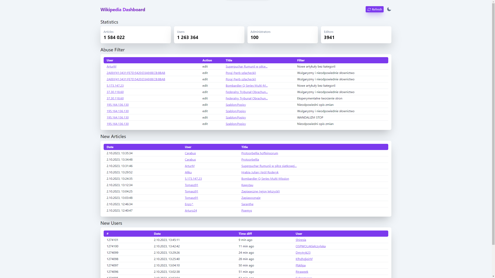

# Wikipedia Dashboard


## About the project
A dashboard is designed to make easier supervise real-time changes made on Wikipedia. It can be used in various ways, e.g. for purely informative purposes or for patrolling users to catch suspicious activity.

## Installation
1. Clone the repo
   ```sh
   git clone https://github.com/your_username_/Project-Name.git
   ```
2. Install NPM packages
   ```sh
   npm install
   ```
3. Run application
   ```sh
   npm run dev
   ```
   Done! :smile:
